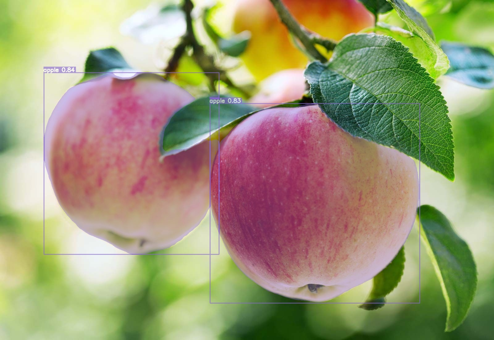

# Yolo Interface

## Requirement

1. `.onnx` format
2. Use OpenCV
3. for yolo segment

## vendor

- [Netron is a viewer for neural network, deep learning and machine learning models.](https://netron.app/)
- base64: https://github.com/ReneNyffenegger/cpp-base64/

## Usage

install yolo:

```bash
pip install ultralytics
```

to onnx format:

```bash
yolo export model=yolo11n-seg.pt format=onnx
```

use Netron:


result:



