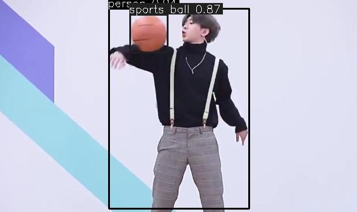
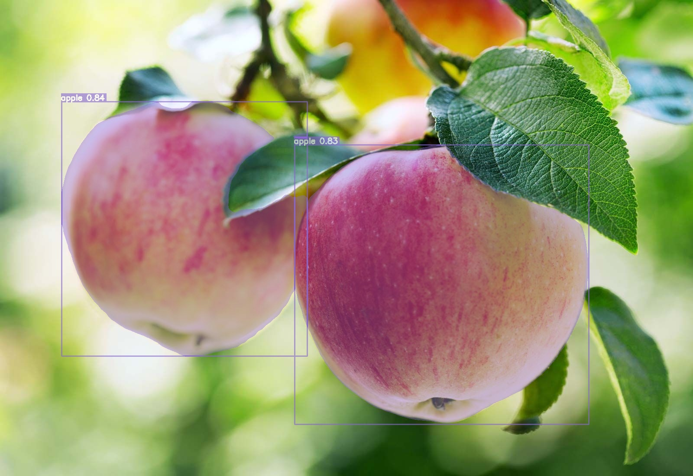
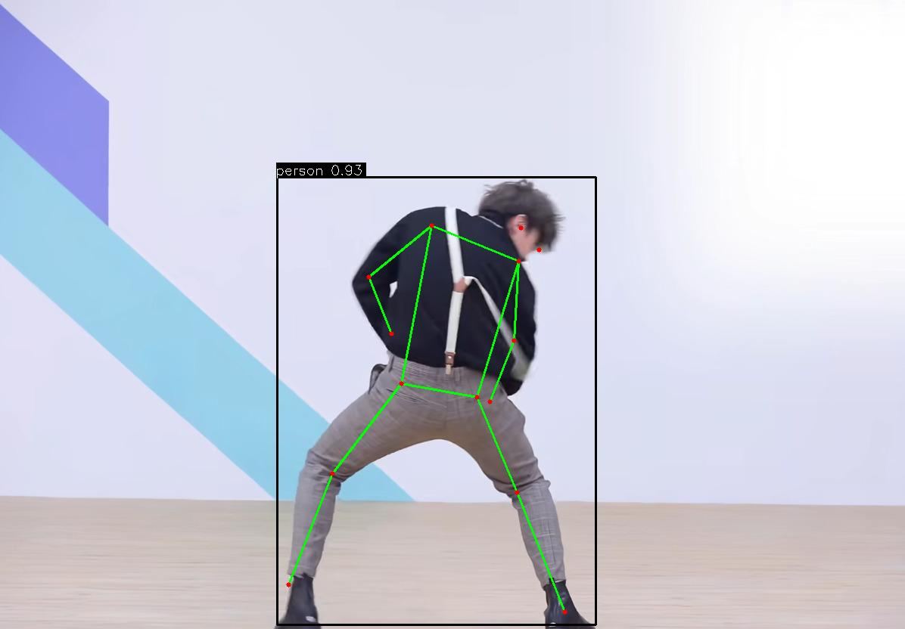
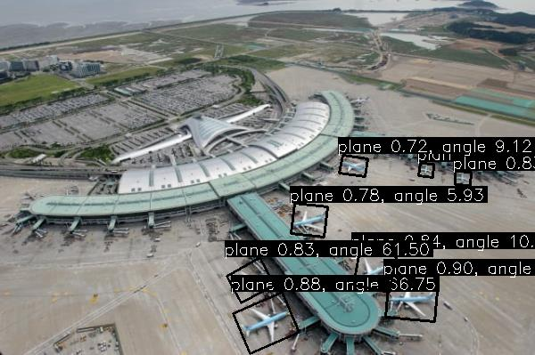
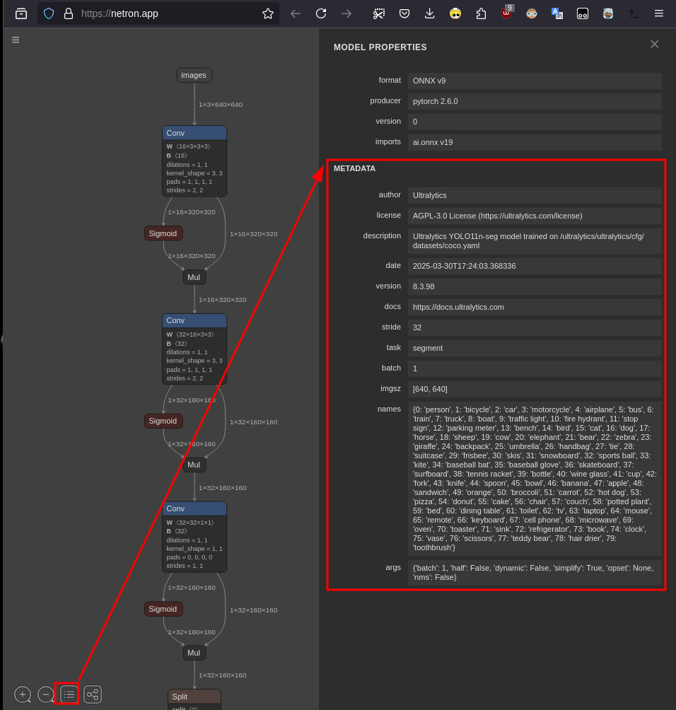

# Yolo Inference

## Support

- YOLO Classify Inference
- YOLO Detect Inference
- YOLO Segment Inference
- YOLO Pose Inference
- YOLO Obb Inference

## Requirement

1. `.onnx` format
2. Use OpenCV

## Vendor

- [Netron is a viewer for neural network, deep learning and machine learning models.](https://netron.app/)

## Usage

```bash
mkdir build
cmake ..
make -j7
./test_explict # explic usage of MyYoloInference library
./test_implict # implic usage of MyYoloInference library
```

## Result

### classify


### detect



### segment



### pose



### obb




## Other Tools

install yolo:

```bash
pip install ultralytics
```

to onnx format:

```bash
yolo export model=yolo11n-seg.pt format=onnx
```

use Netron:


