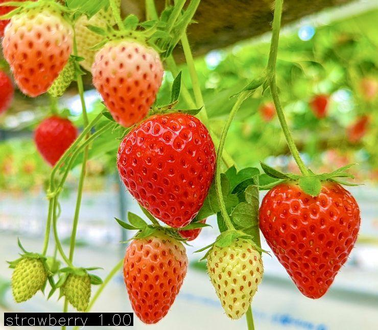

# Yolo Inference

## Support

- YOLO Classify Inference
- YOLO Detect Inference
- YOLO Segment Inference
- YOLO Pose Inference
- YOLO Obb Inference

## Requirement

1. `.onnx` format
2. Use OpenCV(>= 4.8, Otherwise, some parts may need to be modified)

## Vendor

- [Netron is a viewer for neural network, deep learning and machine learning models.](https://netron.app/)
- [JSON Editor Online](https://jsoneditoronline.org)
- [cpp-base64](https://github.com/ReneNyffenegger/cpp-base64)
- [Base64 to Image Decode](https://www.rapidtables.com/web/tools/base64-to-image.html)

## Usage

```bash
mkdir build
cd build
cmake ..
make -j7
./test_explict      # explic usage of MyYoloInference library
./test_implict      # implic usage of MyYoloInference library
./test_binary_input # binary image in, json format string out
```

## Result

### classify



### detect


### segment


### pose


### obb


## Other Tools

install yolo:

```bash
pip install ultralytics
```

to onnx format:

```bash
yolo export model=yolo11n-seg.pt format=onnx
```

use Netron:


